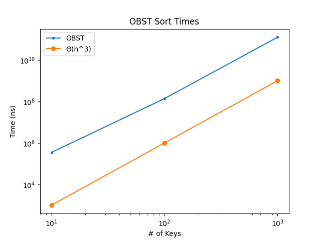

# Optimal Binary Search Tree Algorithm

## Overview

This project's goal was to implement the Optimal Binary Search Tree (OBST) Algorithm and test it's rate of growth against the predicted rate of growth.
The project is built up from multiple scripts working together. The components are listed.

* OBST script
* Random Key Generation script
* File Handler script
* Testing script
* Plotting script
* Binary Search Tree object script
* User Interface script

## OBST script

File containing the implementation of the optimal binary search tree algorithm.

## Random Key Generation script

This script creates a random list of probabilities that sum to 1. It then distributes it into a list for keys and "dummy" keys. The algorthim uses the positional indexes as the number for the key and the dummy keys.

## File Handler script

Handles the reading and writing of files in the program.

## Testing script

This is where different key sizes are tested and the time (in nanoseconds) is recorded.

## Plotting script

Uses the matplotlib library to plot the results of the test.

This grpah shows that the test results (going up to 1 thousand keys, 10 thousand keys took to long to run) grows at the expected rate of *n* cubed.

## Binary Search Tree object script

This file used a python library to create BST out of the root tables. It also outputs their stucture into test files labeled 'bst_numberOfProbabilites.txt' in the img folder.

## User Interface script

This file held the string scripts used to display to the user when running the program.

## Operation

To run the script make sure you have the python libraries needed and then run the "program.py" script.